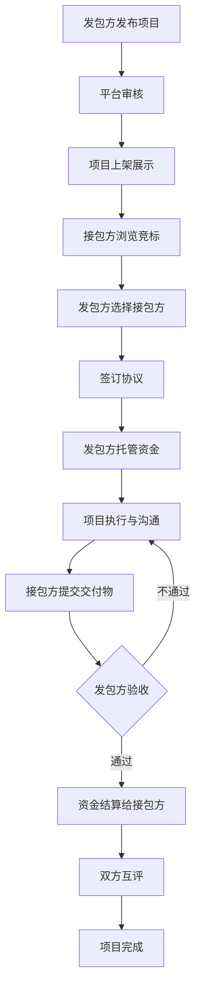

## 1. 产品概述

自由职业者项目外包接单平台，连接发包方与接包方，实现项目发布、竞标、在线沟通、资金托管与结算的全流程服务。解决外包交易中的信任问题、沟通效率问题和资金安全问题。

目标用户：有项目外包需求的企业/个人（发包方），以及提供专业服务的自由职业者/团队（接包方）。

市场价值：通过第三方资金托管和标准化流程，降低外包交易风险，提高对接效率，保障双方权益。

## 2. 核心功能

### 2.1 用户角色

| 角色 | 注册方式 | 核心权限 |
|------|----------|----------|
| 发包方 | 邮箱/手机号注册 | 发布项目、选择接包方、托管资金、验收项目、评价 |
| 接包方 | 邮箱/手机号注册 | 浏览项目、提交竞标、沟通需求、提交交付物、申请结算 |
| 管理员 | 后台登录 | 用户管理、项目审核、纠纷处理、平台配置 |

### 2.2 功能模块

1. **用户认证模块**：注册、登录、角色选择、个人信息管理
2. **项目管理模块**：发布项目、项目列表、项目详情、项目状态管理
3. **竞标管理模块**：提交竞标、竞标列表、选择接包方
4. **在线沟通模块**：实时消息、项目对话、文件传输
5. **资金托管模块**：充值、资金托管、验收结算、退款、提现
6. **评价系统模块**：双方互评、信用评分、评价展示

### 2.3 页面详情

| 页面名称 | 模块名称 | 功能描述 |
|----------|----------|----------|
| 首页/登录页 | 认证模块 | 用户登录、注册、角色选择 |
| 控制台/仪表盘 | 数据概览 | 项目统计、资金概览、待办事项 |
| 项目列表页 | 项目管理 | 项目搜索、筛选、列表展示 |
| 项目详情页 | 项目管理 | 项目信息、竞标列表、操作按钮 |
| 发布项目页 | 项目管理 | 填写项目信息、预算、周期、要求 |
| 竞标提交页 | 竞标管理 | 提交报价、周期、方案说明 |
| 聊天页面 | 沟通模块 | 实时对话、消息历史、文件发送 |
| 钱包/资金页 | 资金模块 | 余额、充值、提现、交易记录 |
| 个人中心页 | 用户管理 | 信息编辑、密码修改、信用展示 |

## 3. 核心流程

### 3.1 项目发包流程

发包方注册登录 → 发布项目（填写需求、预算、周期）→ 平台审核 → 项目上架 → 接包方竞标 → 发包方选择接包方 → 签订电子协议 → 发包方托管资金 → 项目开始

### 3.2 项目执行与结算流程

项目进行中 → 双方在线沟通 → 接包方提交交付物 → 发包方验收 → 验收通过 → 资金结算给接包方 → 双方互评 → 项目完成

### 3.3 流程图

## 4. 用户界面设计

### 4.1 设计风格

- **主色调**：深蓝色 (#1e40af)，代表专业、信任、可靠
- **辅助色**：橙色 (#f97316)，代表活力、行动、警示
- **中性色**：深灰 (#1f2937)、中灰 (#6b7280)、浅灰 (#f3f4f6)
- **按钮风格**：圆角 6px，悬停过渡效果，主按钮深蓝色填充，次按钮描边
- **字体**：标题使用 "Noto Sans SC"，正文使用系统字体栈
- **布局风格**：卡片式布局，顶部导航栏 + 侧边栏 + 主内容区
- **图标风格**：简洁线性图标，使用 Lucide Icons

### 4.2 页面设计概述

| 页面名称 | 模块名称 | UI 元素 |
|----------|----------|----------|
| 登录页 | 认证模块 | 渐变背景、居中卡片、表单动画、社交登录 |
| 仪表盘 | 数据概览 | 数据卡片、统计图表、待办列表、快捷入口 |
| 项目列表 | 项目管理 | 搜索筛选栏、卡片网格/列表切换、分页 |
| 项目详情 | 项目管理 | 信息分栏、竞标列表 tab、状态时间线 |
| 聊天页面 | 沟通模块 | 会话列表、消息气泡、输入框、附件上传 |
| 资金页面 | 资金模块 | 余额卡片、交易流水、操作按钮组 |

### 4.3 响应式设计

- 桌面端优先（1280px+）：完整侧边栏 + 主内容区
- 平板端（768px-1279px）：可折叠侧边栏，自适应内容宽度
- 移动端（<768px）：底部导航栏，卡片单列布局，触摸优化按钮

### 4.4 动效设计

- 页面加载：元素渐入 + 轻微上移动画，stagger 延迟
- 按钮交互：悬停时阴影加深 + 轻微缩放，点击时按压效果
- 消息通知：右上角滑入动画，未读红点呼吸效果
- 状态切换：平滑过渡动画，进度条渐变填充
