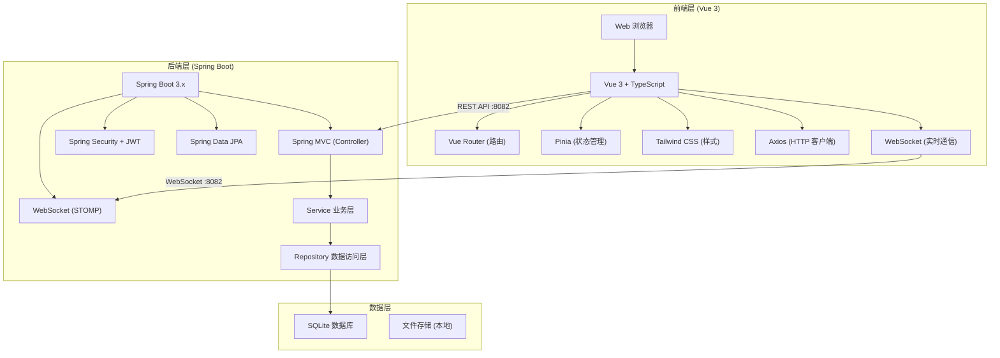
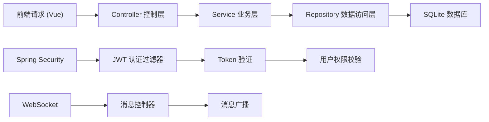
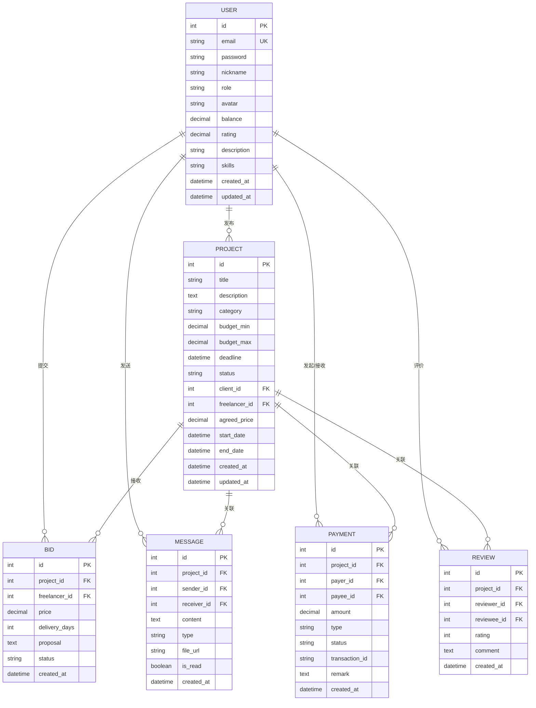

## 1. 架构设计



## 2. 技术选型说明

| 层级 | 技术选型 | 版本 | 说明 |
|------|----------|------|------|
| 前端 | Vue | 3.x | 渐进式 JavaScript 框架，使用 Composition API |
| 前端 | TypeScript | 5.x | 类型安全的 JavaScript 超集 |
| 前端 | Vue Router | 4.x | Vue 官方路由管理 |
| 前端 | Pinia | 2.x | Vue 官方状态管理库 |
| 前端 | Tailwind CSS | 3.x | 原子化 CSS 框架 |
| 前端 | Axios | 1.x | HTTP 客户端，用于 API 请求 |
| 前端 | Vite | 5.x | 下一代前端构建工具 |
| 后端 | Spring Boot | 3.2.x | Java 企业级应用框架 |
| 后端 | Spring Security | 6.x | 安全认证框架 |
| 后端 | JJWT | 0.12.x | JWT 令牌生成与验证 |
| 后端 | Spring Data JPA | 3.x | ORM 数据访问框架 |
| 后端 | SQLite JDBC | 3.45.x | SQLite 数据库驱动 |
| 后端 | Hibernate Community Dialects | 6.4.x | SQLite Hibernate 方言 |
| 数据库 | SQLite | 3.x | 轻量级嵌入式关系型数据库 |

## 3. 项目目录结构

### 3.1 后端 (backend)

```
backend/
├── src/
│   ├── main/
│   │   ├── java/
│   │   │   └── com/freelance/platform/
│   │   │       ├── PlatformApplication.java          # 启动类
│   │   │       ├── config/                            # 配置类
│   │   │       │   ├── SecurityConfig.java            # 安全配置
│   │   │       │   ├── WebSocketConfig.java           # WebSocket 配置
│   │   │       │   └── CorsConfig.java                # 跨域配置
│   │   │       ├── controller/                        # 控制器层
│   │   │       │   ├── AuthController.java            # 认证接口
│   │   │       │   ├── UserController.java            # 用户接口
│   │   │       │   ├── ProjectController.java         # 项目接口
│   │   │       │   ├── BidController.java             # 竞标接口
│   │   │       │   ├── MessageController.java         # 消息接口
│   │   │       │   └── PaymentController.java         # 支付接口
│   │   │       ├── service/                           # 服务层
│   │   │       │   ├── AuthService.java
│   │   │       │   ├── UserService.java
│   │   │       │   ├── ProjectService.java
│   │   │       │   ├── BidService.java
│   │   │       │   ├── MessageService.java
│   │   │       │   └── PaymentService.java
│   │   │       ├── repository/                        # 数据访问层
│   │   │       │   ├── UserRepository.java
│   │   │       │   ├── ProjectRepository.java
│   │   │       │   ├── BidRepository.java
│   │   │       │   ├── MessageRepository.java
│   │   │       │   ├── PaymentRepository.java
│   │   │       │   └── ReviewRepository.java
│   │   │       ├── entity/                            # 实体类
│   │   │       │   ├── User.java
│   │   │       │   ├── Project.java
│   │   │       │   ├── Bid.java
│   │   │       │   ├── Message.java
│   │   │       │   ├── Payment.java
│   │   │       │   └── Review.java
│   │   │       ├── dto/                               # 数据传输对象
│   │   │       │   ├── request/
│   │   │       │   └── response/
│   │   │       ├── security/                          # 安全相关
│   │   │       │   ├── JwtTokenProvider.java
│   │   │       │   ├── JwtAuthenticationFilter.java
│   │   │       │   └── CustomUserDetailsService.java
│   │   │       ├── exception/                         # 异常处理
│   │   │       │   ├── GlobalExceptionHandler.java
│   │   │       │   └── BusinessException.java
│   │   │       └── common/                            # 公共类
│   │   │           ├── Result.java
│   │   │           └── enums/
│   │   └── resources/
│   │       ├── application.yml                        # 应用配置
│   │       └── schema.sql                             # 初始化脚本
│   └── test/
├── pom.xml                                            # Maven 配置
└── data/                                              # SQLite 数据目录
```

### 3.2 前端 (frontend)

```
frontend/
├── src/
│   ├── api/                                           # API 接口
│   │   ├── auth.ts
│   │   ├── project.ts
│   │   ├── bid.ts
│   │   ├── message.ts
│   │   └── payment.ts
│   ├── assets/                                        # 静态资源
│   ├── components/                                    # 公共组件
│   │   ├── Layout/
│   │   ├── Navbar.vue
│   │   ├── Sidebar.vue
│   │   └── common/
│   ├── composables/                                   # 组合式函数
│   │   ├── useAuth.ts
│   │   └── useWebSocket.ts
│   ├── router/                                        # 路由配置
│   │   └── index.ts
│   ├── stores/                                        # Pinia 状态
│   │   ├── auth.ts
│   │   └── app.ts
│   ├── types/                                         # TypeScript 类型
│   │   ├── api.ts
│   │   └── models.ts
│   ├── utils/                                         # 工具函数
│   │   ├── request.ts
│   │   └── format.ts
│   ├── views/                                         # 页面组件
│   │   ├── Login.vue
│   │   ├── Register.vue
│   │   ├── Dashboard.vue
│   │   ├── ProjectList.vue
│   │   ├── ProjectDetail.vue
│   │   ├── CreateProject.vue
│   │   ├── Chat.vue
│   │   ├── Wallet.vue
│   │   └── Profile.vue
│   ├── App.vue
│   └── main.ts
├── public/
├── index.html
├── package.json
├── vite.config.ts                                     # Vite 配置 (端口 3082)
├── tsconfig.json
└── tailwind.config.js
```

## 4. 路由定义

| 路由路径 | 页面名称 | 权限要求 | 说明 |
|----------|----------|----------|------|
| /login | 登录页 | 公开 | 用户登录 |
| /register | 注册页 | 公开 | 用户注册 |
| /dashboard | 仪表盘 | 登录用户 | 数据概览 |
| /projects | 项目列表 | 登录用户 | 浏览所有项目 |
| /projects/:id | 项目详情 | 登录用户 | 查看项目详情和竞标 |
| /projects/create | 发布项目 | 发包方 | 创建新项目 |
| /my-projects | 我的项目 | 登录用户 | 我发布/参与的项目 |
| /chat | 消息列表 | 登录用户 | 会话列表 |
| /chat/:projectId | 聊天窗口 | 项目相关方 | 项目对话 |
| /wallet | 我的钱包 | 登录用户 | 资金管理 |
| /profile | 个人中心 | 登录用户 | 个人信息管理 |

## 5. API 接口定义

### 5.1 认证接口

```typescript
// POST /api/auth/login
interface LoginRequest {
  email: string;
  password: string;
}

interface LoginResponse {
  token: string;
  user: UserInfo;
}

// POST /api/auth/register
interface RegisterRequest {
  email: string;
  password: string;
  nickname: string;
  role: 'CLIENT' | 'FREELANCER';
}

// GET /api/auth/me
interface UserInfo {
  id: number;
  email: string;
  nickname: string;
  role: string;
  avatar: string;
  balance: number;
  rating: number;
}
```

### 5.2 项目接口

```typescript
// GET /api/projects
interface ProjectListRequest {
  page: number;
  size: number;
  status?: string;
  category?: string;
  keyword?: string;
}

interface Project {
  id: number;
  title: string;
  description: string;
  budgetMin: number;
  budgetMax: number;
  deadline: string;
  status: 'DRAFT' | 'PUBLISHED' | 'BIDDING' | 'IN_PROGRESS' | 'DELIVERED' | 'COMPLETED' | 'CANCELLED';
  clientId: number;
  clientName: string;
  freelancerId?: number;
  freelancerName?: string;
  createdAt: string;
  bidCount: number;
}

// POST /api/projects
interface CreateProjectRequest {
  title: string;
  description: string;
  category: string;
  budgetMin: number;
  budgetMax: number;
  deadline: string;
  requirements: string;
}
```

### 5.3 竞标接口

```typescript
// POST /api/projects/:projectId/bids
interface CreateBidRequest {
  price: number;
  deliveryDays: number;
  proposal: string;
}

interface Bid {
  id: number;
  projectId: number;
  freelancerId: number;
  freelancerName: string;
  freelancerAvatar: string;
  price: number;
  deliveryDays: number;
  proposal: string;
  status: 'PENDING' | 'ACCEPTED' | 'REJECTED';
  createdAt: string;
}
```

### 5.4 消息接口

```typescript
// WebSocket /ws/chat
interface ChatMessage {
  id: number;
  projectId: number;
  senderId: number;
  senderName: string;
  content: string;
  type: 'TEXT' | 'FILE';
  fileUrl?: string;
  createdAt: string;
}

// GET /api/messages/:projectId
interface MessageListRequest {
  projectId: number;
  page: number;
  size: number;
}
```

### 5.5 支付接口

```typescript
// POST /api/payments/escrow
interface EscrowRequest {
  projectId: number;
  amount: number;
}

// POST /api/payments/release
interface ReleaseRequest {
  projectId: number;
  amount: number;
}

interface Payment {
  id: number;
  projectId: number;
  amount: number;
  type: 'ESCROW' | 'RELEASE' | 'REFUND' | 'DEPOSIT' | 'WITHDRAW';
  status: 'PENDING' | 'COMPLETED' | 'FAILED';
  createdAt: string;
}
```

## 6. 后端架构图



## 7. 数据模型设计

### 7.1 ER 图



### 7.2 DDL 语句

```sql
-- 用户表
CREATE TABLE IF NOT EXISTS `user` (
  `id` INTEGER PRIMARY KEY AUTOINCREMENT,
  `email` VARCHAR(100) NOT NULL UNIQUE,
  `password` VARCHAR(255) NOT NULL,
  `nickname` VARCHAR(50) NOT NULL,
  `role` VARCHAR(20) NOT NULL,
  `avatar` VARCHAR(255),
  `balance` DECIMAL(10,2) DEFAULT 0.00,
  `rating` DECIMAL(3,2) DEFAULT 5.00,
  `description` TEXT,
  `skills` VARCHAR(500),
  `created_at` DATETIME DEFAULT CURRENT_TIMESTAMP,
  `updated_at` DATETIME DEFAULT CURRENT_TIMESTAMP
);

-- 项目表
CREATE TABLE IF NOT EXISTS project (
  id INTEGER PRIMARY KEY AUTOINCREMENT,
  title VARCHAR(200) NOT NULL,
  description TEXT NOT NULL,
  category VARCHAR(50),
  budget_min DECIMAL(10,2) NOT NULL,
  budget_max DECIMAL(10,2) NOT NULL,
  deadline DATETIME,
  status VARCHAR(20) NOT NULL DEFAULT 'DRAFT',
  client_id INTEGER NOT NULL,
  freelancer_id INTEGER,
  agreed_price DECIMAL(10,2),
  start_date DATETIME,
  end_date DATETIME,
  created_at DATETIME DEFAULT CURRENT_TIMESTAMP,
  updated_at DATETIME DEFAULT CURRENT_TIMESTAMP,
  FOREIGN KEY (client_id) REFERENCES `user`(id),
  FOREIGN KEY (freelancer_id) REFERENCES `user`(id)
);

-- 竞标表
CREATE TABLE IF NOT EXISTS bid (
  id INTEGER PRIMARY KEY AUTOINCREMENT,
  project_id INTEGER NOT NULL,
  freelancer_id INTEGER NOT NULL,
  price DECIMAL(10,2) NOT NULL,
  delivery_days INTEGER NOT NULL,
  proposal TEXT,
  status VARCHAR(20) NOT NULL DEFAULT 'PENDING',
  created_at DATETIME DEFAULT CURRENT_TIMESTAMP,
  FOREIGN KEY (project_id) REFERENCES project(id),
  FOREIGN KEY (freelancer_id) REFERENCES `user`(id)
);

-- 消息表
CREATE TABLE IF NOT EXISTS message (
  id INTEGER PRIMARY KEY AUTOINCREMENT,
  project_id INTEGER NOT NULL,
  sender_id INTEGER NOT NULL,
  receiver_id INTEGER NOT NULL,
  content TEXT NOT NULL,
  type VARCHAR(20) DEFAULT 'TEXT',
  file_url VARCHAR(255),
  is_read BOOLEAN DEFAULT FALSE,
  created_at DATETIME DEFAULT CURRENT_TIMESTAMP,
  FOREIGN KEY (project_id) REFERENCES project(id),
  FOREIGN KEY (sender_id) REFERENCES `user`(id),
  FOREIGN KEY (receiver_id) REFERENCES `user`(id)
);

-- 支付表
CREATE TABLE IF NOT EXISTS payment (
  id INTEGER PRIMARY KEY AUTOINCREMENT,
  project_id INTEGER,
  payer_id INTEGER NOT NULL,
  payee_id INTEGER NOT NULL,
  amount DECIMAL(10,2) NOT NULL,
  type VARCHAR(20) NOT NULL,
  status VARCHAR(20) NOT NULL DEFAULT 'PENDING',
  transaction_id VARCHAR(100),
  remark TEXT,
  created_at DATETIME DEFAULT CURRENT_TIMESTAMP,
  FOREIGN KEY (project_id) REFERENCES project(id),
  FOREIGN KEY (payer_id) REFERENCES `user`(id),
  FOREIGN KEY (payee_id) REFERENCES `user`(id)
);

-- 评价表
CREATE TABLE IF NOT EXISTS review (
  id INTEGER PRIMARY KEY AUTOINCREMENT,
  project_id INTEGER NOT NULL,
  reviewer_id INTEGER NOT NULL,
  reviewee_id INTEGER NOT NULL,
  rating INTEGER NOT NULL,
  comment TEXT,
  created_at DATETIME DEFAULT CURRENT_TIMESTAMP,
  FOREIGN KEY (project_id) REFERENCES project(id),
  FOREIGN KEY (reviewer_id) REFERENCES `user`(id),
  FOREIGN KEY (reviewee_id) REFERENCES `user`(id)
);

-- 索引
CREATE INDEX IF NOT EXISTS idx_project_status ON project(status);
CREATE INDEX IF NOT EXISTS idx_project_client ON project(client_id);
CREATE INDEX IF NOT EXISTS idx_project_freelancer ON project(freelancer_id);
CREATE INDEX IF NOT EXISTS idx_bid_project ON bid(project_id);
CREATE INDEX IF NOT EXISTS idx_bid_freelancer ON bid(freelancer_id);
CREATE INDEX IF NOT EXISTS idx_message_project ON message(project_id);
CREATE INDEX IF NOT EXISTS idx_message_unread ON message(receiver_id, is_read);
```

## 8. 端口配置

| 服务 | 端口 | 说明 |
|------|------|------|
| Spring Boot 后端 | 8082 | REST API + WebSocket |
| Vue 前端 (开发) | 3082 | Vite dev server |

### 8.1 后端配置 (application.yml)

```yaml
server:
  port: 8082

spring:
  datasource:
    url: jdbc:sqlite:./data/freelance_platform.db
    driver-class-name: org.sqlite.JDBC
    username: admin
    password: admin
  jpa:
    database-platform: org.hibernate.community.dialect.SQLiteDialect
    hibernate:
      ddl-auto: update
    show-sql: true
  sql:
    init:
      mode: always
      schema-locations: classpath:schema.sql
```

### 8.2 前端配置 (vite.config.ts)

```typescript
export default defineConfig({
  server: {
    port: 3082,
    proxy: {
      '/api': {
        target: 'http://localhost:8082',
        changeOrigin: true
      },
      '/ws': {
        target: 'ws://localhost:8082',
        ws: true,
        changeOrigin: true
      }
    }
  }
});
```
